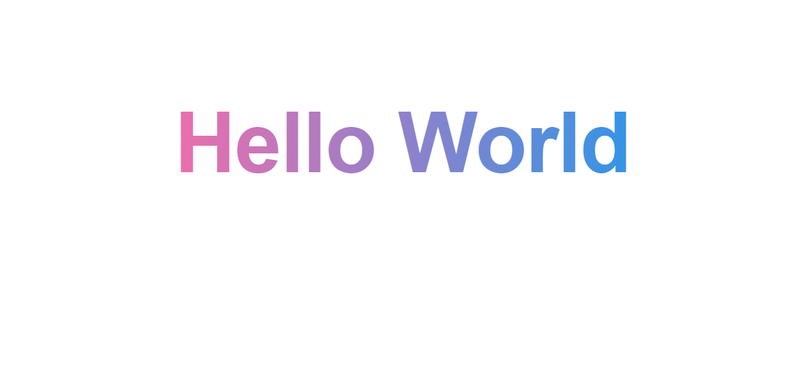

  <h1 align="center">Text Gradient</h1>

<h1 align="center">
    
</h1>

<h4 align="center"> 
 📝 Text Gradient 
</h4>

 <a href="#-tecnologias">Tecnologias</a> 

## 💻 Sobre o projeto

📝 Text Gradient 📝

## 🛠 Tecnologias

As seguintes ferramentas foram usadas na construção do projeto:

#### **Layout**

- **[HTML](https://www.w3schools.com/html/)**
- **[CSS](https://www.w3schools.com/css/)**

#### **Utilitários**

- CodePen: **[TigerCodes](https://codepen.io/tigercodes)**
- Editor: **[Visual Studio Code](https://code.visualstudio.com/)**
- Markdown: **[StackEdit](https://stackedit.io/)**, **[Markdown Emoji](https://gist.github.com/rxaviers/7360908)**

